# CertMon User Manual

## About This Guide

This is the illustrated operator guide for CertMon v1.0, including the features
available in **build 53**. Button and field names below match the English interface.
For installation configuration and technical background, see the [project README](../README.md).

The screenshots show the actual interface with **fictional demonstration data**.
The `192.0.2.x` addresses and `.example.test` names are examples, not addresses to
enter in your installation. The screenshots come from a source run, so the header
shows `build dev`. They demonstrate controls, not a real network scan or successful
deployment. Example Audit results are seeded examples. Screens show an administrator
in server mode; your permissions and desktop/server mode may hide some controls.

## Contents

1. [Start, Sign In And Navigate](#1-start-sign-in-and-navigate)
2. [Find And Inspect Devices](#2-find-and-inspect-devices)
3. [Filter And Select Devices](#3-filter-and-select-devices)
4. [Prepare The Local CA](#4-prepare-the-local-ca)
5. [Create Device Certificates](#5-create-device-certificates)
6. [Choose Upload Methods And Credentials](#6-choose-upload-methods-and-credentials)
7. [Upload Directly With SFTP And SIS](#7-upload-directly-with-sftp-and-sis)
8. [Upload Through Toolbelt](#8-upload-through-toolbelt)
9. [Download And Delete Stored Certificates](#9-download-and-delete-stored-certificates)
10. [Use The Renewal Wizard](#10-use-the-renewal-wizard)
11. [Review, Export And Clean Up Audit](#11-review-export-and-clean-up-audit)
12. [Manage Users And Backups](#12-manage-users-and-backups)
13. [Troubleshooting And Safe Operation](#13-troubleshooting-and-safe-operation)

## 1. Start, Sign In And Navigate

### Desktop Mode

1. Extract the downloaded `CertMon-Windows` archive to a suitable folder.
2. Start `CertMon.exe`. Use the browser URL opened by CertMon.
3. In ordinary desktop mode, the service is local to your computer and does not
   require a CertMon user account. You will not see the server-mode Users controls.
4. To stop CertMon, use **Quit** from its system-tray icon. Closing a browser tab
   does not stop the application.

Packaged builds normally keep installation data under `%PROGRAMDATA%\CertMon`.
Keep the same data directory when updating the executable. Do not delete it to
"reset" an error: it contains your CA, certificates, encrypted secrets and history.

### Server Mode

Use the URL provided by your administrator. Server mode must be explicitly enabled;
it is not switched on by opening the browser on another computer. See the
[server-mode startup instructions](../README.md#shared-server-mode).

1. On a new server installation, enter a username and a password of at least eight
   characters in **Create first admin**. Repeat it in **Confirm password**.
2. Click **Create admin**. Store the credentials securely.
3. On subsequent visits, enter your username and password and click **Sign in**.
4. Check the user/role label at the top-right before making changes. Use **Logout**
   when finished on a shared computer.

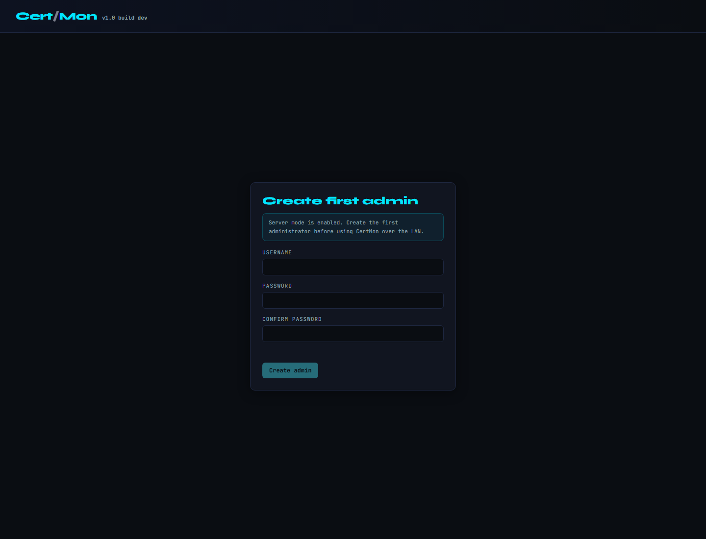

*Figure 1. First-start server setup. Existing installations show Sign in instead.*

Do not publish CertMon directly to the internet. For shared use, your administrator
should provide a trusted network and HTTPS; ordinary HTTP does not encrypt passwords.

### Where To Go

| Area | Use it for |
| --- | --- |
| **Devices** | Current endpoint certificates, filtering, selection and preparation. |
| **Renewals** | Issuance/import tasks and actions required to finish them. |
| **Local CA** | Your signing CA, public trust files, CA backup and manual issuance. |
| **Upload** | Prepared devices, Direct/Toolbelt upload and certificate downloads. |
| **Audit** | Recorded actions, upload outcomes, audit export and history cleanup. |
| **Administration** | Server backups and, in server mode, user administration. |
| Left sidebar | Add endpoints and configure scan ranges. |
| Header counters | Current inventory counts by certificate validity. |

The top-right **Export Excel** button exports the device certificate inventory.
It is different from **Export audit Excel** on the Audit tab. The inventory export
uses the stored inventory, not just the cards currently visible after filtering.

## 2. Find And Inspect Devices

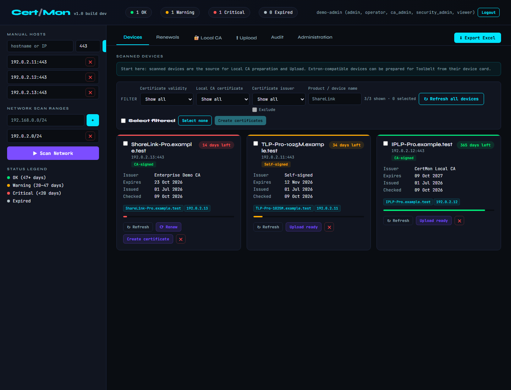

*Figure 2. An inventory with one critical, one warning and one healthy endpoint.*

### Add One Endpoint

1. In **Manual Hosts**, type the device hostname or IP address.
2. Enter its HTTPS port, usually `443`.
3. Click the **+** button beside the fields. CertMon checks that endpoint and adds
   it to the inventory when certificate information is available.
4. Locate its card in **Devices**. If it is not reachable, verify the address,
   HTTPS service, port, routing and firewall access before trying again.

### Scan A Range

1. In **Network Scan Ranges**, type an authorized CIDR range, for example your
   own subnet in the form `192.168.10.0/24`.
2. Click its **+** button. Add other ranges only if you are authorized to scan them.
3. Click **Scan Network** and watch the progress indicator.
4. Review the resulting cards. A device outside the scan scope, offline, or without
   an accessible HTTPS service may not appear. You can add an endpoint manually.

Use small, relevant scan ranges first; scanning a large range takes longer. A scan
reads endpoints. It does not create or install certificates.

### Read A Device Card

The card shows its displayed name, endpoint, certificate type, issuer, expiry,
issue/check dates and certificate identifiers. These are the currently observed
device certificate details, not proof that a newer stored certificate was installed.

| Status | Meaning |
| --- | --- |
| **OK** | 47 or more days remaining. |
| **Warning** | 20 to fewer than 47 days remaining. |
| **Critical** | Fewer than 20 days remaining, before expiry. |
| **Expired** | Certificate validity has ended. |

1. Click **Refresh** on a card to reread that endpoint.
2. Click **Refresh all devices** to reread every known endpoint, including devices
   hidden by filters. Read the progress and failure message beside the button.
3. Review **Checked** and the issuer/expiry after the refresh.

An unreachable device can retain previously recorded certificate information.
Do not treat its old card as confirmation of a fresh successful check.

The card's red **X** removes that monitored endpoint from the inventory. It does
not uninstall the certificate from the physical device.

## 3. Filter And Select Devices

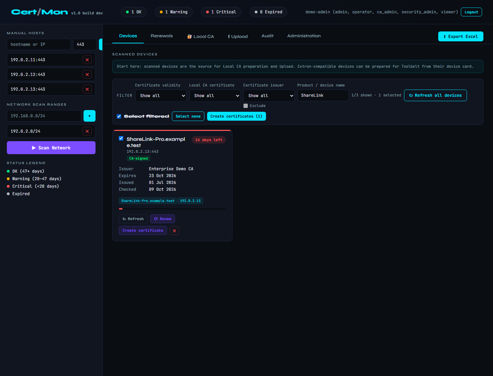

*Figure 3. Product/device-name filtering leaves ShareLink visible and selected.*

Use the toolbar above the cards. It remains available while scrolling through devices.

| Control | Example use |
| --- | --- |
| **Certificate validity** | Show only Warning, Critical or Expired endpoints. |
| **Local CA certificate** | **Not created** finds endpoints without a prepared Local CA certificate; **Created** finds prepared ones. |
| **Certificate issuer** | Choose an issuer found in the inventory, including self-signed. |
| **Exclude** | Hide the chosen issuer, such as CertMon Local CA. |
| **Product / device name** | Enter part of a displayed name, such as `TLP`, `IPLP` or `ShareLink`. |

Filters combine. Clear the name field and choose **Show all** to widen the view.
Name filtering is a text match, not a guaranteed device-model detection system.

To prepare several devices:

1. Apply the desired filters.
2. Tick individual card checkboxes or **Select filtered**.
3. Check the **shown / selected** counter. Selections can remain when you change
   filters; review the selection rather than assuming it equals the visible cards.
4. Click **Create certificates** when enabled. Read any profile, replacement or
   result messages before continuing.
5. Use **Select none** to clear selections for the currently filtered set.

**Created** means CertMon has prepared a Local CA certificate. It does not mean
that the device is already using that certificate. Check the actual issuer or
refresh the endpoint to determine what is installed.

## 4. Prepare The Local CA

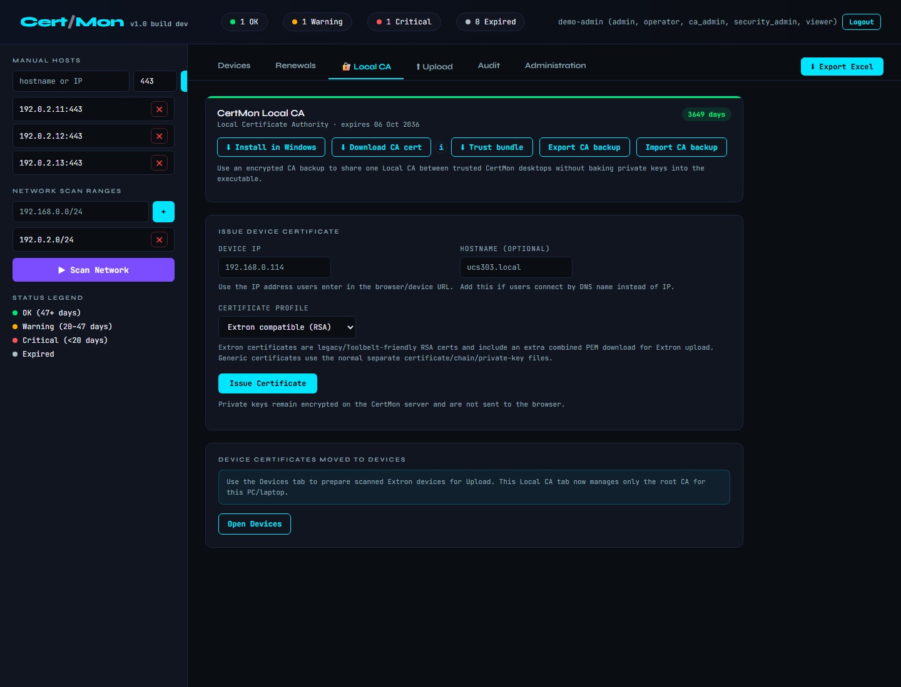

*Figure 4. An existing Local CA, public trust downloads and manual issuance fields.*

1. Open **Local CA**.
2. If there is no CA, choose **Generate Local CA**, or **Import CA backup** if your
   administrator has provided the organization's existing CertMon CA backup.
3. Wait for creation/import to finish and verify that the CA information appears.
4. Install the **public** CA certificate on the computers/browsers that must trust
   your device certificates. Creating a CA alone does not install trust on clients.

Do not generate a separate CA on every operator computer when devices are intended
to share one organization CA. Agree which CA should sign certificates before issuing.

### Install Or Share Public Trust

- **Install in Windows** installs trust on the Windows computer running CertMon;
  in server mode that is the server, not a remote user's browser computer.
- **Download CA cert** downloads the public `.crt` file for manual installation.
- **Trust bundle** downloads the public CA certificate and trust-installation notes
  for other operator computers. It contains no CA private key.

For manual Windows installation, open the downloaded `.crt`, choose **Install
Certificate**, select the appropriate Current User or Local Machine store, and
place it in **Trusted Root Certification Authorities** according to your IT policy.
Confirm only a CA you trust. Restart the browser and check a device again. Other
clients may have their own trust store; use their vendor instructions.

### Back Up The CA

1. Click **Export CA backup** and enter the requested backup passphrase.
2. Store the encrypted backup and passphrase securely, separately where practical.
3. Use **Import CA backup** only on a trusted installation. Review its replacement
   confirmation: importing CA signing state is not the same as importing trust.

The CA backup transfers signing material. It is different from the full server
backup described in [section 12](#12-manage-users-and-backups).

## 5. Create Device Certificates

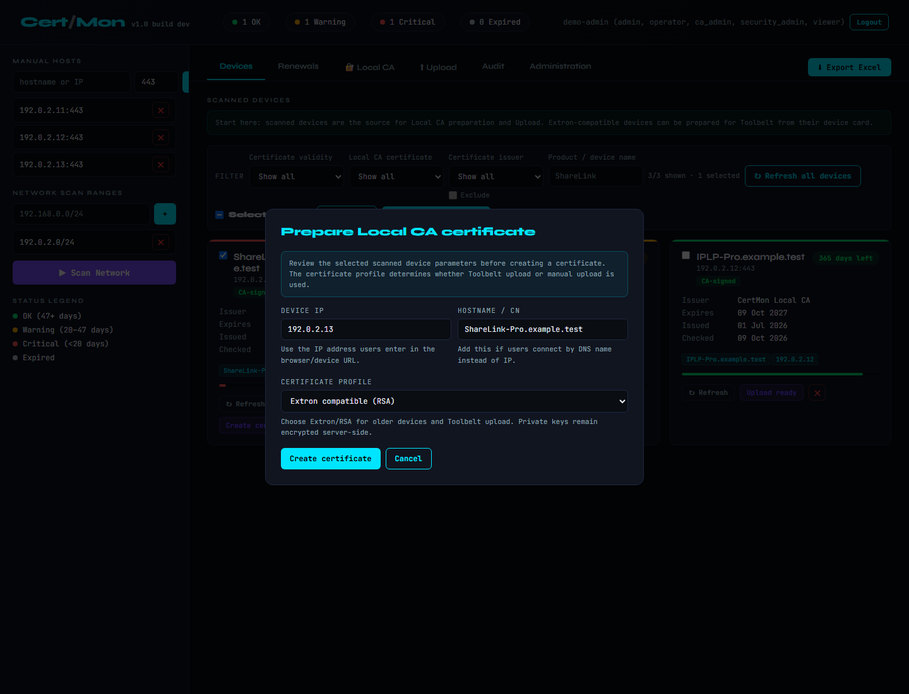

*Figure 5. Review the device IP, hostname and compatibility profile before creation.*

For a single scanned device:

1. Open **Devices** and click **Create certificate** on its card.
2. Check **Device IP**. Include the address users will enter when connecting.
3. Check **Hostname / CN**. Include the name users will actually use, where applicable.
4. Choose **Certificate profile**. Use **Extron compatible (RSA)** for the supported
   Extron Direct/Toolbelt workflow; use an appropriate generic profile for manual
   installation on other devices.
5. Click **Create certificate** and wait for the creation result.
6. Click **View upload options** when offered, or open **Upload**.

Choose a profile based on device/firmware compatibility, not just a product-name
match. A hostname or IP not included in the certificate can still produce a browser
identity error even when the CA is trusted.

If a certificate already exists, CertMon can offer **Open Upload**, **Open downloads**
or **Issue new**. If the device already has an upload selection, issuing another
certificate asks whether to cancel or replace it. Replacement keeps one upload
row per address and does not erase older stored certificates.

For an endpoint not in inventory, use the **Issue Certificate** form on **Local CA**.
Enter the IP/hostname and profile, then find its result under **Upload** >
**Certificate downloads**. Issuing or preparing a certificate does not deploy it.

## 6. Choose Upload Methods And Credentials

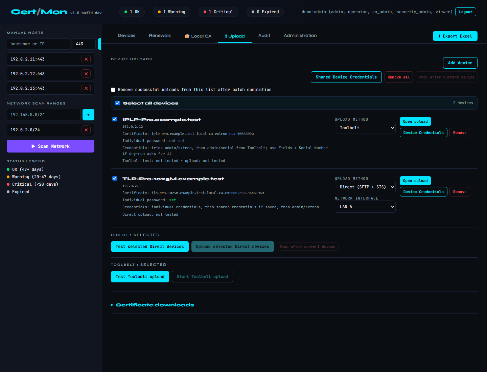

*Figure 6. One device is set to Direct, another to Toolbelt. Tests have not been run.*

1. Open **Upload**. Check each device address and certificate ID.
2. Choose **Direct (SFTP + SIS)** or **Toolbelt** in each row's **Upload method** list.
3. Tick the rows you want to process. The Direct and Toolbelt counters show the
   selected devices for each method, not one combined mixed-method batch.
4. Enter credentials and interface settings before running a test.

**Add device** takes you back to Devices to prepare a certificate. A scanned device
without a suitable prepared certificate is not automatically ready for upload.

### Save Credentials

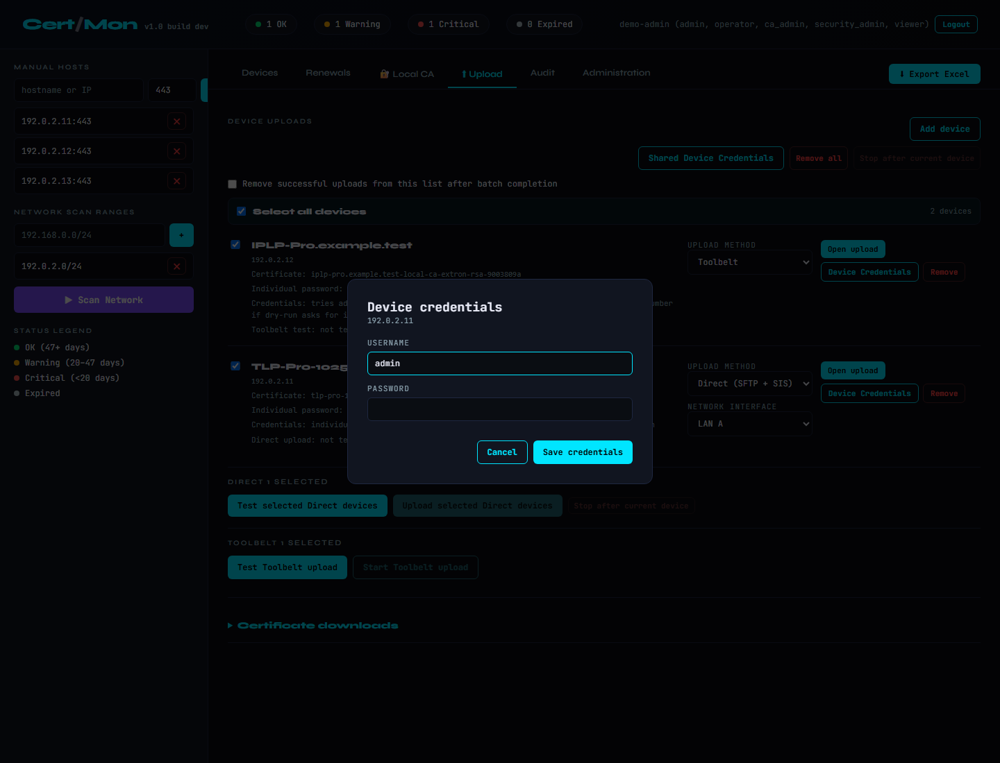

*Figure 7. Device credentials for one address. Existing passwords are not displayed.*

1. Click **Device Credentials** in a row for that device, or **Shared Device
   Credentials** above the list for the shared defaults.
2. Check the target shown in the dialog.
3. Enter the intended **Username** and **Password**.
4. Click **Save credentials**. Check the row's **Individual password: set / not set**.

**Set** confirms that a non-empty individual password is saved. It does not confirm
that the device has accepted it. The password field is blank when the dialog opens
because saved passwords are never displayed. Enter the password you intend to save;
the form requires a non-empty value. Passwords are encrypted in storage and are not
sent back to the browser for display.

Both methods try credentials in this order:

1. Individual credentials, if their password is non-empty.
2. Shared credentials, if their password is non-empty.
3. Factory default `admin` / `extron`.
4. **Toolbelt only:** `admin` / device serial number, when available.

Blank and duplicate candidates are skipped. A password rejection advances to the
next candidate. An unreachable device or changed SSH host key is not fixed by trying
more passwords. Direct does not use a serial-number fallback.

### Choose LAN A Or LAN B

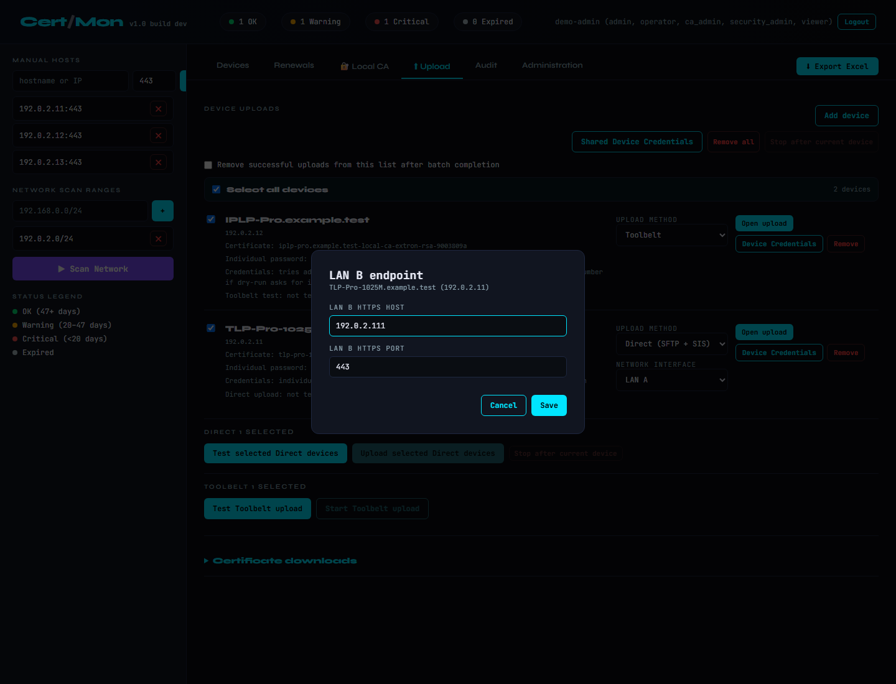

*Figure 8. Enter the reachable LAN B HTTPS endpoint for the selected device.*

1. Set the row's **Upload method** to Direct.
2. Choose **LAN A** or **LAN B** in that row's **Network interface** control.
3. For LAN B, enter its **LAN B HTTPS host** and **LAN B HTTPS port**, then click **Save**.
4. Confirm the row shows the intended interface. These settings are per device.

In the current implementation, the configured LAN B host is used for SFTP
(`22022`), SSH/SIS (`22023`) and HTTPS verification (the port you enter). Ensure all
three services are reachable at that host. It is not a verification-only address
with SSH/SFTP still connecting to LAN A. The stored device selector and credential
lookup remain associated with the original prepared device.

## 7. Upload Directly With SFTP And SIS

### Batch Upload

1. Select the prepared Direct devices and review their IPs and LAN interfaces.
2. Click **Test selected Direct devices**. Read the result beside every device.
3. Resolve any credential, network or host-key errors first.
4. When testing succeeds for the selected configuration, click **Upload selected
   Direct devices**. Review the confirmation and click **Start batch upload**.
5. Wait while devices are processed one at a time. **Stop after current device**
   requests a stop before the next device, not a forced interruption of the current one.
6. Check the per-device results and **Audit**. The workspace refreshes the involved
   monitored devices after an actual upload batch finishes.

Changing the selected devices, certificate or interface can invalidate a previous
test. Run the test again if the upload button becomes disabled.

Batch testing automatically stores previously unseen SSH host keys on first use.
A changed stored key blocks the device for review. First-use acceptance is not an
independent identity verification: use trusted network access and verify the intended
device addresses. Never accept a changed key without investigating the device change.

### Individual Upload And Host-Key Review

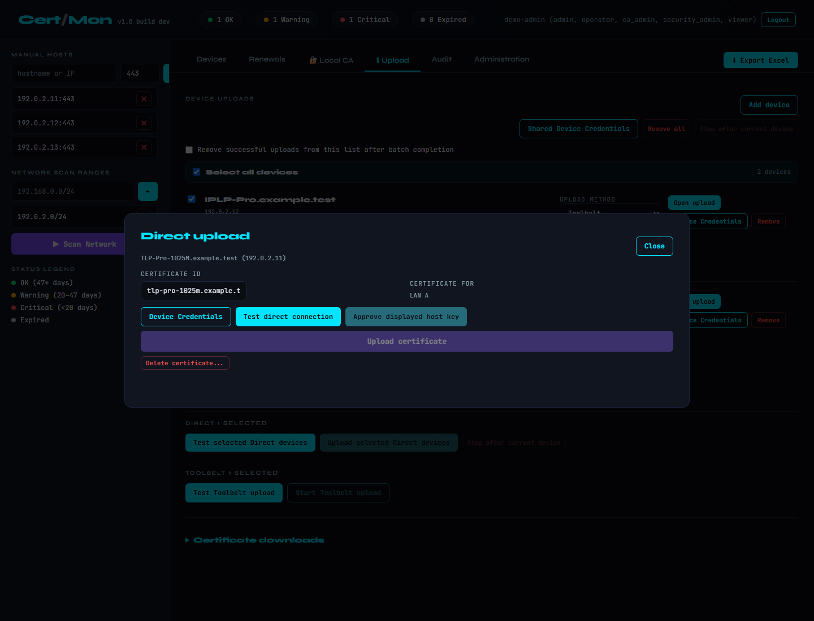

*Figure 9. Individual connection test, host-key review, upload and device-removal controls.*

1. Click **Open upload** in a Direct row.
2. Check the device and selected LAN interface.
3. Click **Test direct connection**.
4. If requested, verify the displayed SSH fingerprint and use **Approve displayed
   host key** only after you have checked that it is the intended device/key.
5. Click **Upload certificate** when enabled and read the result.
6. Expand **Technical details** only when troubleshooting; the main result should
   tell you whether verification succeeded or attention is needed.

Direct uses SFTP port `22022` and SSH/SIS port `22023`; HTTPS verification uses the
selected endpoint/port. A successful file transfer alone is not deployment success.
Confirmed success requires the expected import acknowledgement and HTTPS certificate
verification. Normal Direct import does not request a reboot.

For an unconfirmed import or cleanup-pending result, do not repeatedly upload or
delete temporary PEM files while the device might still be processing. Wait, inspect
the device, then use **Confirm processing finished and retry cleanup** only after
you have confirmed that processing has finished. Refresh the endpoint afterwards.

### Remove A Certificate From A Device

In **Open upload**, use **Delete certificate...** and review the LAN A/B selection
and confirmation. This removes the device's selected-interface certificate through
SIS. It does **not** delete the stored CertMon certificate. HTTPS behavior after
removal depends on the device; do not assume it will keep presenting a CA-signed
certificate. Use this only as an intentional maintenance operation.

## 8. Upload Through Toolbelt

Use the same prepared-device list shown in Figure 6, but set the relevant rows to
**Toolbelt**.

Before starting, install Extron Toolbelt on the Windows computer that actually runs
CertMon. A remote browser user's PC is not where server-side Toolbelt automation runs.
Keep the Windows desktop available for UI automation and avoid manually changing
Toolbelt windows or dialogs during a run. Run Toolbelt and CertMon at the same
privilege level.

1. Select the Toolbelt rows and check their credentials.
2. Click **Test Toolbelt upload**.
3. Watch the device results. The dry-run prepares targeting and certificate fields
   but does not click Apply or reboot devices.
4. For devices whose dry-run is OK, click **Start Toolbelt upload** for the real run.
5. Wait for completion or use **Stop after current device** to request a safe stop.
6. Review each row and Audit, then refresh the device later if it is still restarting.

CertMon uses Toolbelt's **Add** dialog to enter the device address and credentials,
then locates its exact IP row and opens management once. It does not require you to
search a long Discovery list, and it does not assume an existing device is at the top.

| Toolbelt result | What to do |
| --- | --- |
| **Authentication Failed** | Review the individual/shared password; the next configured candidate is tried without the full connection timeout. |
| **Device Unreachable** | Check power, routing, address and management-port reachability. The device is skipped without repeating password attempts. |
| Serial number unavailable | In Toolbelt, show **Fields** > **Serial Number** and retry the dry-run. Use toolbar overflow/scrolling if needed. |
| Add dialog/control not found | Check that Toolbelt is installed, visible and at the same privilege level; retain the reported error for support. |

Serial-number fallback cannot discover the serial number of a device that has never
been added successfully. It may use a serial number already available in Toolbelt.

### Automatically Remove Successful Upload Rows

Enable **Remove successful uploads from this list after batch completion** before
the real run if you want successful entries hidden afterwards. The option is off by
default. Failed/unconfirmed entries remain for review; tests do not clear the list,
and stopped/failed batches retain their entries. A verified individual Direct upload
can also hide its row when the option is enabled.

This is list cleanup, not certificate deletion. Stored files and device credentials
remain, and Audit records successful and unsuccessful uploads with their addresses.

## 9. Download And Delete Stored Certificates

*Figure 10. The selected certificate, filenames, manual-install steps and server deletion.*

### Download The Correct Version

1. Open **Upload** and expand **Certificate downloads**.
2. Choose a **Certificate / device** entry. Its label includes the creation date and
   time in **UTC**, profile and certificate ID; newest entries appear first.
3. Click **Show certificate downloads** if the details are not already visible.
4. Check **Downloads for**, the certificate ID and creation time. Changing the
   selection updates the links immediately.
5. Download the files required by the device's own import procedure.

| Download | Contains / intended use |
| --- | --- |
| `certificate.pem` | Public endpoint certificate. |
| `chain.pem` / `full-chain.pem` | Public chain material, according to the device's requirements. |
| **Extron combined PEM (certificate + private key)** | Extron-compatible combined certificate/key import file; secret. |
| **Private key (.pem)** | Separate matching key for generic/manual imports; secret. |
| **Download all Extron PEMs (.zip)** | All stored Extron combined PEMs, including older versions and certificates whose successful upload rows were hidden; secret. |

Individual link filenames identify the selected certificate. Read those filenames
instead of relying only on generic labels such as `certificate.pem`.

**Certificate downloads** does not itself upload to a device. Follow the displayed
manual steps or click **Upload Guide** for method guidance, then use the device's
interface or Toolbelt manually. Protect downloaded keys/combined PEMs and remove
local copies when no longer needed. A creation date here is the stored certificate
record's creation time, not the device card's last-check time or proof of installation.

### Delete A Stored Certificate

1. Select the certificate/version you want to remove.
2. At the bottom of its download details, click **Delete certificate from server**.
3. Read the device name, certificate ID and creation date in the confirmation.
4. Confirm only if you no longer need that certificate or matching stored key.
5. Check the result message and dropdown. The removed version disappears; other
   certificates remain. Audit records the deletion.

This deletes the chosen stored certificate and its public/private-key files from
CertMon. It does **not** remove certificates already installed on devices, delete
the Local CA, or erase saved device passwords. If file removal fails, CertMon keeps
the certificate entry and reports an error instead of falsely reporting success.

### Know Which Removal You Are Using

| Action | Effect |
| --- | --- |
| Automatic successful-upload cleanup | Hides successful prepared rows; stored certificates, keys, credentials and device certificates remain. |
| **Delete certificate from server** under downloads | Permanently removes the selected stored certificate/key set; device certificates and saved credentials remain. |
| **Delete certificate...** in Direct Open upload | Removes the selected-interface certificate from the device; the stored CertMon certificate remains. |
| **Remove / Remove all** in the prepared upload list | Deletes associated Local CA device certificates, not merely row selection. Read the confirmation; this existing removal path may also remove saved credentials for those devices. |
| Red **X** on a Devices card | Removes a monitored endpoint, not a certificate installed on the device. |

## 10. Use The Renewal Wizard

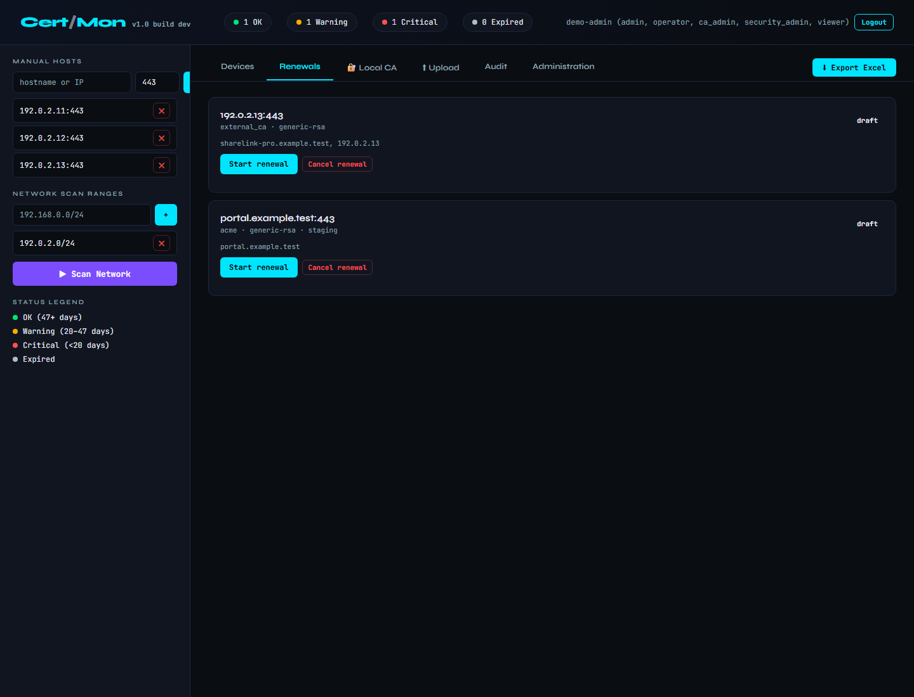

*Figure 11. Example draft tasks for ACME staging and an external CA.*

Use **Renew** on a device card to open the four-step renewal wizard. A renewal task
tracks work that may need DNS, CA or deployment actions; it is not proof that the
device has already received a replacement certificate.

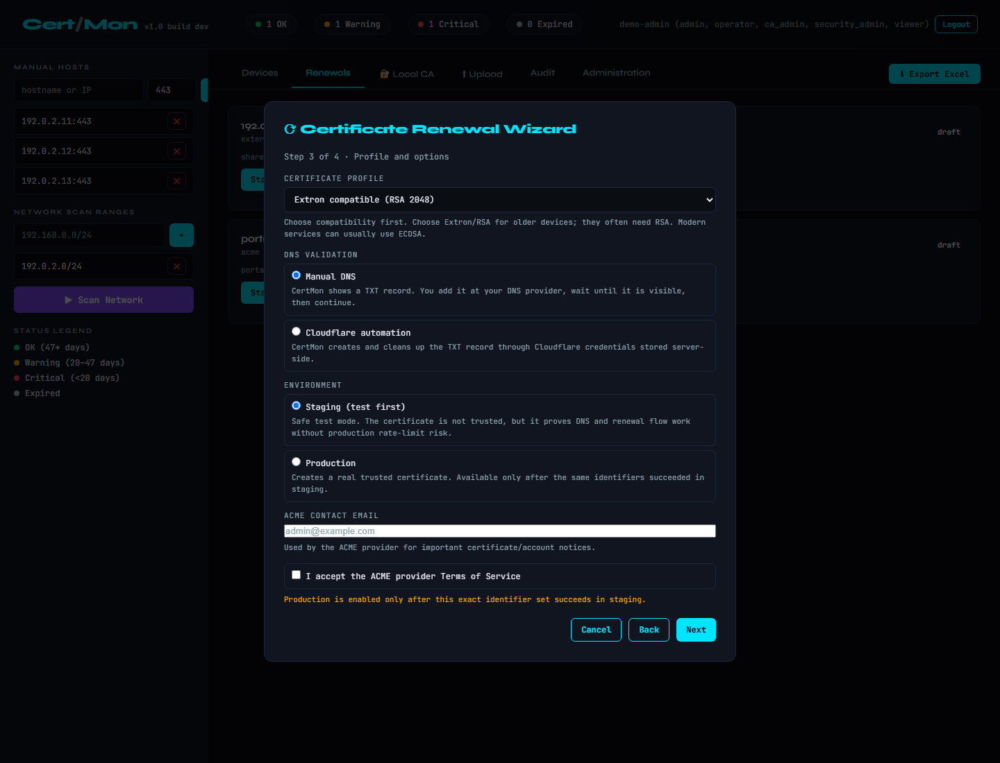

*Figure 12. Step 3 of the actual wizard: profile, DNS method and ACME environment.*

1. **Endpoint and identifiers:** verify the host/IP and port CertMon connects to,
   then enter one intended certificate DNS name/private IP per line.
2. **Issuer:** choose **Let's Encrypt (public ACME)**, **CertMon Local CA**, or
   **External CA or existing certificate**.
3. **Profile and options:** choose the compatible certificate profile and options
   for the selected issuer.
4. **Review:** check the summary, then click **Review and start**. Use **Back** to
   correct a field or **Cancel** to close the wizard before starting.

### Let's Encrypt / ACME

Use public DNS names, not private IPs/internal names. Start with **Staging (test
first)**, choose Manual DNS or Cloudflare automation, enter the contact email and
accept the provider Terms of Service. Production requires successful staging for
the same normalized identifier set; changing the names requires a matching test.

With **Manual DNS**, find the TXT **Name** and **Value** in the task when it is
awaiting DNS. Create the exact record at the DNS provider, wait for propagation,
then click **Verify and continue**. Complete the offered cleanup step when required.
Do not guess a TXT value or reuse one from an older task.

With **Cloudflare automation**, configure the requested zone/token using the
available credentials controls. Use a token scoped to the intended zones with
Zone DNS Edit and Zone Read, not a global API key. Missing permissions can prevent
validation or cleanup even when the endpoint itself is reachable.

### Local CA And External CA

Local CA tasks issue for private IPs/internal names using your existing CA. Clients
must trust its public CA certificate. For an external CA CSR workflow, download the
CSR when requested, have your CA sign it, then use **Import signed certificate** with the
matching returned certificate/chain. For an existing certificate workflow, import
the certificate and its matching private key using the fields offered by the UI.
CertMon validates the certificate/key/chain; unrelated files cannot be combined.

### Read The Task State

The **Renewals** card displays the endpoint, issuer, profile, environment, identifiers
and state. Buttons change with that state. Use **Start renewal**, **Verify and
continue**, **Import signed certificate**, **Import certificate**, **Deploy now** or
**Retry cleanup** only when offered and after correcting the
underlying problem. Review failed/deployment-pending messages; do not assume issuance
success means deployment success. **Delete entry** removes a task entry, not a
certificate from a physical device.

## 11. Review, Export And Clean Up Audit

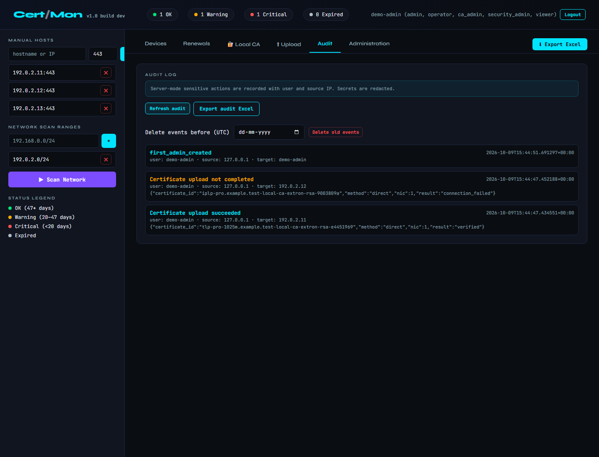

*Figure 13. Fictional successful/failed upload records demonstrate the address and result fields.*

1. Open **Audit** and click **Refresh audit**.
2. Match the target IP/certificate and timestamp to the operation you performed.
3. Read the result and details. The acting user and source IP identify who initiated
   an action, not necessarily the device being uploaded to.
4. After batch cleanup, use Audit to review uploads even when successful rows are
   no longer in the Upload list.

The screen displays the latest 100 events. **Export audit Excel** exports **all
stored audit events**, including timestamps (UTC), event type, user, source IP,
target, result and details. Use Excel filtering to compare addresses or periods.
This is not the inventory report produced by the top-right Export Excel button.

To remove old history:

1. Export the audit first if it must be retained.
2. Choose **Delete events before (UTC)**.
3. Click **Delete old events** and read the permanent-deletion confirmation.
4. Confirm. CertMon shows how many events were deleted and records the cleanup.

The date is a strict cutoff at **00:00 UTC**. Selecting `2026-10-01` removes events
before that moment; events on October 1 and later are kept. The date must not be
in the future. Local display formatting of the date picker does not change the
UTC cutoff. Only Admin can delete history in server mode; Admin and Security Admin
can export it. Standalone mode permits both operations.

## 12. Manage Users And Backups

### Users And Permissions

*Figure 14. Users controls appear only for administrators in server mode.*

1. Open **Administration** and find **Users**.
2. Click the information **i** button beside **Add user** to review the current
   role/permission table.
3. Click **Add user**, enter the username/password and select the intended roles.
4. Save and test that user's access in a separate private browser session.
5. Use the row actions to edit roles, enable/disable an account or reset a password.

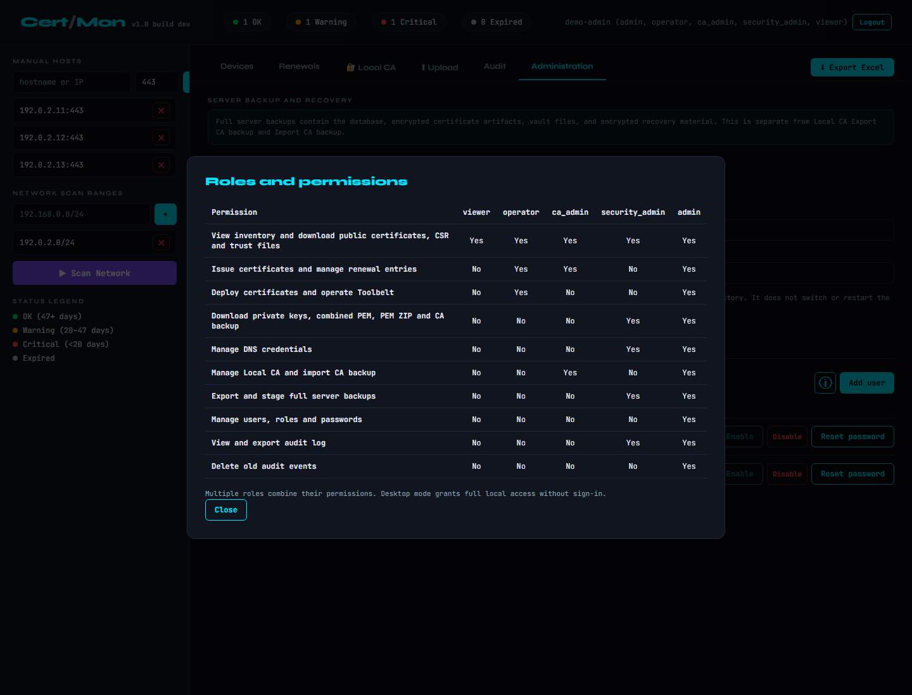

*Figure 15. Multiple roles combine their rights; the dialog shows the actual permission table.*

| Role | Typical use |
| --- | --- |
| **Viewer** | Read inventory and download public certificate/trust files. |
| **Operator** | Issue/renew and deploy certificates; not private-key export. |
| **CA Admin** | Manage the Local CA and its device certificates. |
| **Security Admin** | Private-key/DNS credentials, audit viewing/export and server backups. |
| **Admin** | Full permissions, user management and audit deletion. |

A role change, account disable or password reset revokes existing sessions; affected
users must sign in again. At least one enabled administrator must remain. Users
controls are intentionally absent in standalone mode, which has no server accounts
to manage. Missing controls often indicate permissions, not a broken interface.

### Full Server Backup

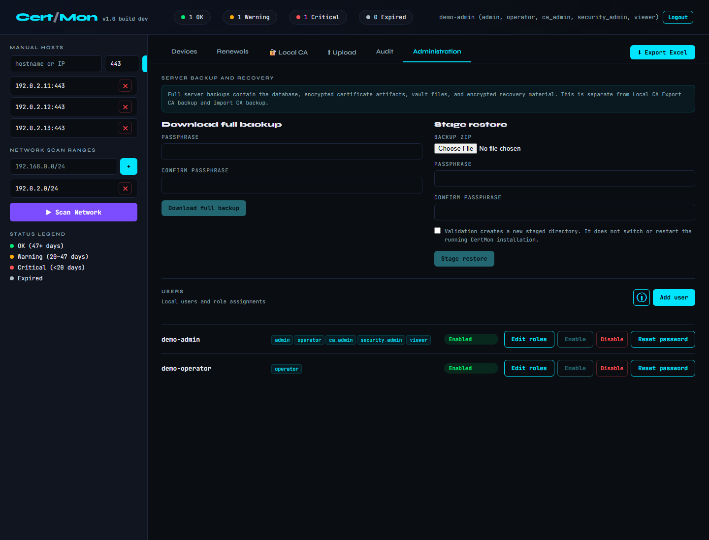

*Figure 16. Export and restore fields for the complete CertMon installation.*

1. Open **Administration** > **Server backup and recovery**.
2. In the export fields, enter a new strong **Passphrase** and repeat it in
   **Confirm passphrase**.
3. Click **Download full backup** when enabled.
4. Store the ZIP and its passphrase securely. Together they can recover sensitive
   installation material; do not put them in an ordinary support ticket/file share.

The backup contains installation state, including database records, encrypted
certificate artifacts, vault/recovery material, users and Audit. It is not just a
download of public certificates or a Local CA-only backup.

### Stage A Restore

1. Select the **Backup ZIP** and enter/confirm its passphrase.
2. Review and tick the required consent checkbox.
3. Click **Stage restore** and read the validation/result message.
4. Stop CertMon before activating the staged directory. Follow the returned
   recovery instructions; the current running data directory is not overwritten.
5. Restart with the intended restored data directory and verify users, the CA,
   representative certificates and Audit before removing old data.

Staging is not activation. See [Recovery and Backup](../README.md#recovery-and-backup)
for the activation procedure. Ask your administrator rather than moving/deleting
data directories while CertMon is running.

## 13. Troubleshooting And Safe Operation

| What you see | Check / next step |
| --- | --- |
| A tab or button is missing | Check the signed-in role and desktop/server mode. Ask an administrator for the required permission. |
| An upload button is disabled | Select devices of that method, prepare compatible certificates, save the required settings, then pass the method's test/dry-run. Test again after changing selection/interface. |
| Individual password says **set** but login fails | Set means stored, not validated. Review the configured username/password and fallback order. |
| Device absent after a scan | Check range, address, HTTPS port and reachability; try an authorized manual endpoint. |
| Wrong certificate still appears after upload | Review the upload result, wait for processing/restart, then Refresh. Confirm the intended LAN interface and HTTPS endpoint. |
| Direct import/cleanup is unconfirmed | Inspect the device and wait. Do not automatically repeat uploads or delete staged PEMs during processing. |
| SSH host key changed | Investigate device replacement/reset or unexpected routing. Verify the new fingerprint before approval. |
| Browser still warns after Local CA issuance | Check client trust, certificate identifiers, validity and whether the new certificate is actually installed. |
| Several downloads have the same device name | Compare creation time, profile, certificate ID and the displayed download filenames. Select the intended version. |
| Upload list becomes empty after success | Check automatic successful-upload cleanup; files remain under Certificate downloads and outcomes remain in Audit. |
| CertMon is still running after closing the browser | Use the system-tray Quit command. |

Before a real upload, confirm the target device, address, certificate version,
credentials and LAN interface. Use a maintenance window for devices whose HTTPS
service may be interrupted. Do not share passwords, private keys, combined PEMs,
CA backups or full-server backup passphrases in screenshots or support messages.

When reporting a problem, include the CertMon build number, upload method, device
model/firmware, relevant timestamp and redacted status/error text. Distinguish a
connection test from a real upload and issuance from deployment. Keep private key
material and credentials out of the report.
